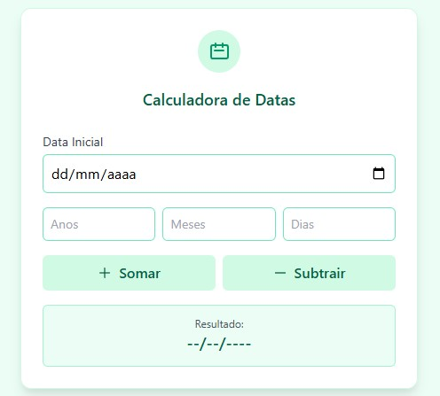

# 📅 Calculadora de Datas

Uma calculadora simples e funcional para somar ou subtrair **anos, meses e dias** a partir de uma data inicial.  
Desenvolvida com **HTML**, **JavaScript** e estilizada com **Tailwind CSS**. 🌱

---
## ✨ Prévia do Projeto

  
  
<i>📸 Exemplo de uso da interface da Calculadora de Datas</i>

## 🚀 Teste Agora!

👉 [Clique aqui para testar o projeto](https://darkphoenixbr.github.io/CalculatorPro/)  

---

## 🧠 Funcionalidades

- Inserir uma data inicial 📌  
- Adicionar ou subtrair:
  - 🗓️ Anos
  - 📆 Meses
  - 📅 Dias  
- Ver o resultado no formato brasileiro: `dd/mm/aaaa`
- Interface responsiva e amigável 🌿

---

## 🛠️ Tecnologias Usadas

- 🔹 **HTML5**
- 🔸 **JavaScript (Vanilla)**
- 🔹 **Tailwind CSS v2.2.19**

---

## 🤝 Contribuições

Fique à vontade para abrir uma issue, enviar um pull request ou dar uma estrela ⭐ no repositório se curtir o projeto!

---

## 📄 Licença
  
Sinta-se livre para usar e adaptar! 💚
